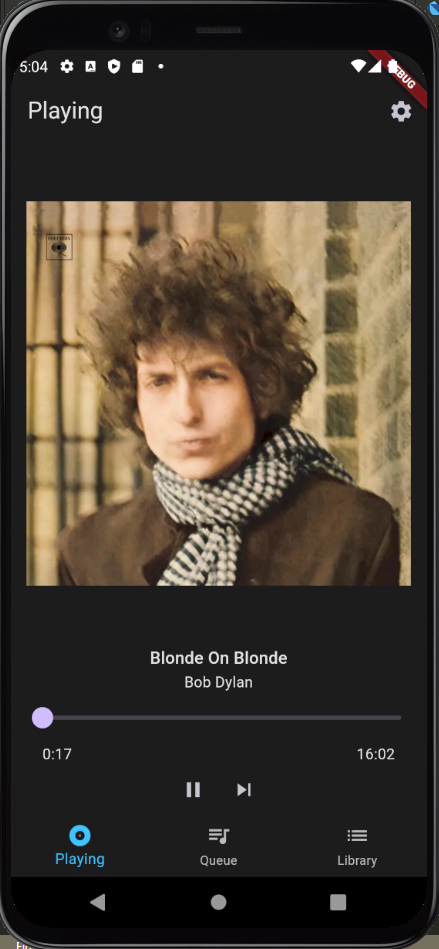
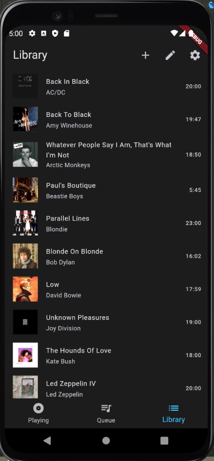
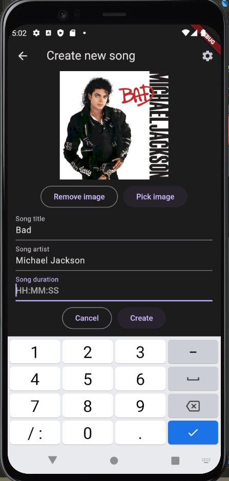
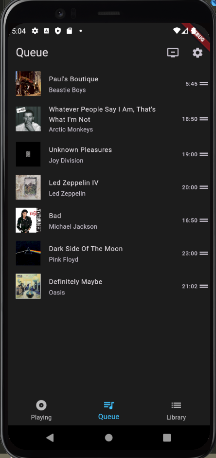

# Music server and client
* Server written in Python
  * Can hook up the music server to many different targets
  * Created an interface for a player, but very extendable and adaptable
  * Broadcast capabilities to update the clients if a change has occured
* Client written in Flutter
  * Supports multiple platforms, nothing is device specific code
  * Number of calls to the server for information is minimal, only when the state changes, not when the song is playing
* API defined using OpenAPI
  * Use the generating features of OpenAPI for the flutter client
  * Define your API once in the Python side, and use it in the client

- [x] Support multiple devices concurrently
- [x] Use generic code so it can run on several platforms
- [x] Define your API once (This is actually awesome)

**Why did I not use another repo on GitHub or the like?**

I have tried to adapt two other kind of projects, one I had to try and write my own plugin to hack this functionality in. But I did not have the freedom.
And the other one was a project in Android studio, but I could not morph it into a nice app, using coding patterns only made the code more unreadable eventually.

**What is the goal of this project**

The original target device for which this is written is a Jukebox project, so new songs (Vinyls) can be added, and their duration can change.
There are still some improvement points, but after several attempts of using other people code it was never so adaptable to connect your own 'virtual player' to it and have multi-device safety.

## If you use this

I'm very curious what you make with it! Ofcourse there are small behaviour improvements possible.
And would be nice to make it really ***POP***, but this is an excellent base to work on with for your own project!
I hope it provides you with a base point I could not find

## Features

Does not actually connect to a device that plays, however it emulates something that is playing
Override the BasePlayer or our own implemented player where needed to hook your own target on the server side

## What does it look like?

